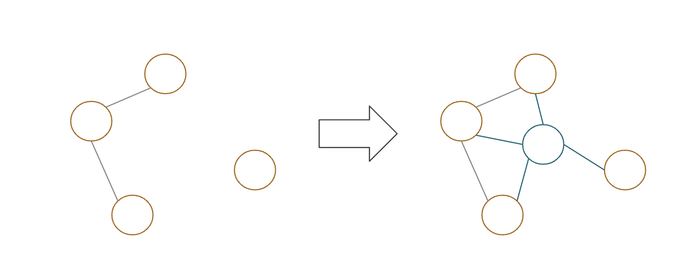
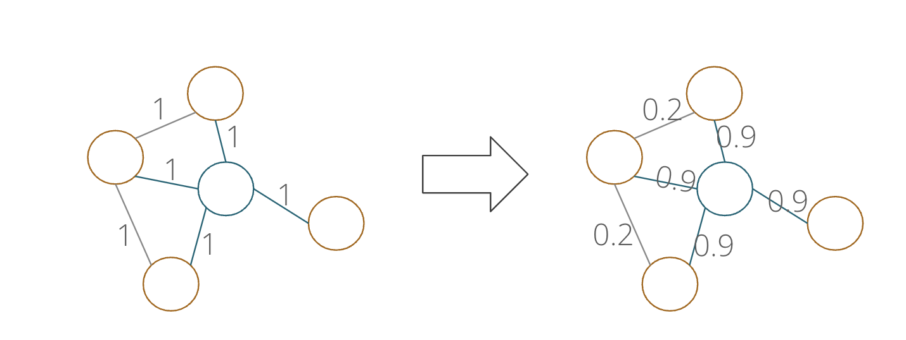

# Self Configuring Graph Convolution Networks

Node Additions and Edge Reweighting for GCNs, an implementation of this [paper](https://demalworkshop.github.io/www2021/papers/graphconvolutional.pdf).

[Presentation Slides](https://docs.google.com/presentation/d/1bN8da3-dBA4xuT2kXDnbZZP2raAQpId0lUpIEqDu8vI/edit?usp=sharing)

Node Addition: Adding new nodes based on similarities of features, acting as communication centers

Edge Reweighting: Learns dependencies better

